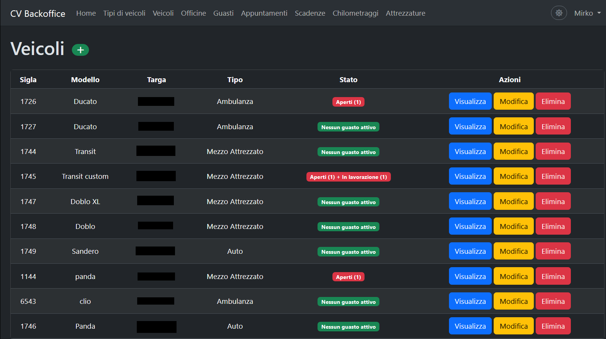

# 🚀 CV Backoffice

> Applicazione web per gestire in modo centralizzato mezzi, guasti, manutenzioni, scadenze, chilometraggi e dotazioni di bordo.




---

## 🌍 Demo

<!-- Inserisci qui i link reali: URL del sito live e una demo video o GIF del flusso principale. -->
- Live: https://tuo-link-demo.com
- Video/GIF: https://tuo-link-demo-video.com

---

## 🌟 Caratteristiche principali

- **Gestione completa del parco mezzi**: anagrafica veicoli, tipologie, provider e storico operativo in un unico pannello.
- **Flusso guasti e manutenzioni**: dalla segnalazione problema alla chiusura intervento con tracciamento date e stato.
- **Controllo scadenze e dotazioni**: monitoraggio revisioni, assicurazioni, ossigeno e attrezzature con visione centralizzata.

---

## 🛠️ Tech Stack

| Tecnologia | Scopo |
| :--------- | :---- |
| **Laravel (PHP)** | Core applicativo e logica backend |
| **Blade + Bootstrap (Laravel Breeze)** | Interfaccia amministrativa |
| **MySQL/MariaDB (SQLite in sviluppo)** | Persistenza dati |

### 🔌 API utilizzate

- **Car List JSON dataset**: `https://raw.githubusercontent.com/matthlavacka/car-list/master/car-list.json`
  - usata per importare **brand** e **modelli** veicolo tramite il comando `php artisan import:car-data`

### ⚙️ Funzionalità Laravel utilizzate

- **Eloquent ORM** per modelli, relazioni e query applicative
- **Migrations e Seeders** per struttura e popolamento iniziale del database
- **Form Requests** per la validazione dei dati lato backend
- **Laravel Breeze** per autenticazione e gestione sessione utente
- **Livewire** per componenti dinamici come `VehicleSelect`
- **Observers** per automatizzare logiche su entità legate ai veicoli
- **Artisan Commands** personalizzati, come `php artisan import:car-data` per importare dati da API esterne
- **Filesystem / Storage pubblico** per la gestione degli upload documentali

---

## 🚀 Quick Start

### Requisiti

Prima di iniziare, assicurati di avere installato:

- PHP 8.2+
- Composer
- Node.js 18+ e npm
- MySQL/MariaDB (oppure SQLite per sviluppo locale)

### Installazione

```bash
# Clona il repository
git clone https://github.com/mirkobechini/CV_Backoffice.git

# Entra nella cartella del progetto
cd CV_Backoffice

# Installa le dipendenze backend e frontend
composer install
npm install
```

### Avvio

```bash
# Configura ambiente
cp .env.example .env
php artisan key:generate
php artisan import:car-data

# Configura e popola il database
php artisan migrate --seed

# Collega lo storage pubblico
php artisan storage:link

# Avvia frontend e backend (in due terminali separati)
npm run dev
php artisan serve
```

Apri il browser su `http://127.0.0.1:8000`.

---

## 📂 Struttura del progetto

```text
.
|-- app/
|-- bootstrap/
|-- config/
|-- database/
|-- public/
|-- resources/
|-- routes/
|-- tests/
|-- README.md
|-- composer.json
|-- package.json
```

---

## 🗺️ Roadmap

- [x] Rivedere nelle scadenze lo status rinnovata/scaduta (added is_renewed boolean in migration) se rinnovata, non mostrare più come scaduta e spostare in fondo alla lista(aggiungere attuale/valida (ok) a status?)
- [x] Rivedere la creazione automatica delle scadenze ( valutare se mettere tutte a scadute e far andare ad una pagina di modifica)
- [x] Modificare status che di default va a scaduta e non rinnovata
- [ ] Gestione dotazioni di bordo (ossigeno, estintori, attrezzature) con scadenze e revisioni
- [x] Salva in database Models e Brands veicoli da API  (https://raw.githubusercontent.com/matthlavacka/car-list/master/car-list.json)
- [ ] Dashboard con KPI principali (scadenze, guasti aperti, manutenzioni in corso)
- [ ] Report chilometraggi per periodo e per singolo mezzo
- [ ] Modulo API REST per integrazione esterna
- [ ] Test end-to-end sui flussi critici

### Backlog funzionale dettagliato

#### Vehicle / Equipment

- [x] Rivedere VehicleType per gestione equipaggiamento per tipologia mezzo
- [ ] View veicolo: link agli equipaggiamenti del mezzo + stato conformità per equipaggiamento

#### Deadlines / Tagliandi

- [x] In index visualizzare solo scadenze attive (non rinnovate) e scadute, escludendo quelle rinnovate
- [ ] Implementare tagliandi in scadenze: oltre alla data, soglia km per prossimo tagliando

#### MileageLog / Report

- [ ] Report storico chilometri per singolo mezzo (timeline)
- [ ] Report ultimo chilometraggio per mese (singolo mezzo)
- [ ] Filtro per mezzo + range mese/anno

---

## 🤝 Contribuire

Le contribuzioni migliorano il progetto. Per contribuire:

1. Fai fork del repository
2. Crea un branch: `git checkout -b feature/NomeFeature`
3. Esegui commit: `git commit -m "Add NomeFeature"`
4. Fai push del branch: `git push origin feature/NomeFeature`
5. Apri una Pull Request

---

## 📄 Licenza

Distribuito sotto licenza MIT. Vedi il file `LICENSE` per i dettagli.

---

## 📧 Contatti

Mirko Bechini - LinkedIn: https://www.linkedin.com/in/mirko-bechini-892202252 - mirkobechini@gmail.com

Link progetto: https://github.com/mirkobechini/CV_Backoffice
