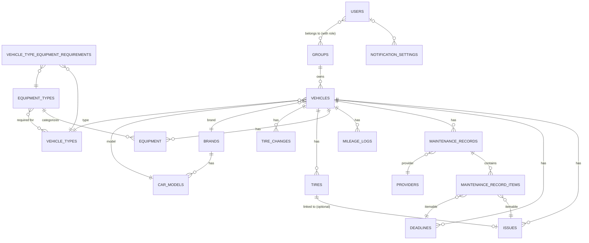

# 🚀 CV Backoffice

> Web application for centralized management of a public-assistance vehicle fleet.
> Faults, maintenance, deadlines, mileage and onboard equipment in a single panel.


---

## 🌟 Key Features

- **Full fleet management**: vehicle records, brands, models, types and documents
- **Fault and maintenance workflow**: from report to closed intervention, with a polymorphic link between faults, deadlines and workshop appointments
- **Deadline and equipment tracking**: ministerial inspections, oxygen check, service, timing belt, insurance — with automatic status based on date and mileage
- **Automatic deadline generation**: timing belt (10 years or 100,000 km), service (1 year or configurable mileage), automatic renewal on intervention completion
- **Mileage tracking**: bulk monthly entry, history, integration with mileage-based deadlines
- **Tire management**: each tire is its own record with a position (front/rear, left/right); a workshop change can involve 1, 2 or 4 tires, not just a full set
- **Equipment**: assign existing equipment records to a vehicle (including moving them from another vehicle)
- **Public fleet status page**: a secret, unguessable link, no account required, showing only vehicle availability (no sensitive data)
- **Interactive dashboard**: stats, upcoming deadlines (with remaining time/mileage and status), open faults, incomplete equipment
- **Appointment calendar**: month/week view with color-coding by activity type
- **PDF and CSV export**: vehicle info sheet as PDF, CSV export for every entity
- **REST API**: 12 token-protected endpoints (Sanctum), built for a future mobile app
- **Audit log**: full tracking of every change
- **In-app notifications**: bell icon with badge, notification list, mark as read
- **Email notifications**: configurable daily/weekly/monthly report with PDF attachment + automatic emails on events (deadlines, faults, equipment)
- **Group-based multi-tenancy**: every user belongs to a group (lead/deputy/member), invite via code; data isolation between groups is applied consistently across every surface — admin pages, Policies, mobile API, CSV/PDF export, cache, notifications and scheduled emails
- **User management**: create and manage roles from the backoffice (lead role only)
- **API tokens**: create and revoke from the profile page
- **Privacy/GDPR**: privacy page, cookie banner, personal data export, lead-role transfer on account deletion
- **Database backup**: Artisan command + button on the settings page
- **Rate limiting**: protection on login, admin routes and API
- **Light/dark theme**: persisted in localStorage
- **Vehicle registration document scan**: create a vehicle by uploading the front/back of the registration document, with an LLM vision provider (configurable, OpenRouter by default) pre-filling license plate, brand/model, technical data and tire size — always reviewed by the user before saving

---

## 🛠️ Tech Stack

| Technology                       | Purpose                             |
| :-------------------------------- | :----------------------------------- |
| **Laravel 12 (PHP 8.2+)**        | Core application and backend logic  |
| **Blade + Bootstrap 5 (Breeze)** | Admin interface                     |
| **Livewire 4**                   | Dynamic components (VehicleSelect)  |
| **MySQL / SQLite**               | Data persistence                    |
| **Laravel Sanctum**              | API token authentication            |
| **spatie/laravel-activitylog**   | Audit logging                       |
| **DomPDF**                       | PDF export                          |
| **FullCalendar**                 | Appointment calendar                |
| **OpenRouter (LLM vision)**      | Vehicle registration document scan  |

---

## 🚀 Quick Start

### Requirements

- PHP 8.2+
- Composer
- Node.js 18+ and npm
- MySQL (or SQLite for local development)

### Installation

```bash
git clone https://github.com/mirkobechini/CV_Backoffice.git
cd CV_Backoffice
composer install
npm install
```

### Configuration

```bash
cp .env.example .env
php artisan key:generate
php artisan storage:link
php artisan migrate --seed
php artisan import:car-data
php artisan make:admin
```

> **Note:** there is no public registration page. The first account is created with `php artisan make:admin` (becomes the lead of a default group); from there, new users are created from the backoffice by a lead/deputy, or join an existing group with its invite code.

### Run

```bash
# Two separate terminals:
npm run dev
php artisan serve
```

Open your browser at `http://127.0.0.1:8000`.

---

## 📸 Screenshots

<!-- Add app screenshots here -->

---

## 🧪 Tests

```bash
php artisan test
```

---

## ☁️ Deploy

The app runs in production on [Laravel Cloud](https://cloud.laravel.com). Steps, environment variables and post-deploy commands are documented in [docs/DEPLOY.md](docs/DEPLOY.md).

---

## 📂 Project Structure

```text
.
|-- app/
|-- bootstrap/
|-- config/
|-- database/
|-- docs/
|   |-- ADR.md           # Architecture Decision Records
|   |-- DEPLOY.md        # Deploy to Laravel Cloud
|-- public/
|-- resources/
|-- routes/
|-- tests/
|-- README.md
|-- composer.json
|-- package.json
```

---

## 📐 Architecture Decisions

The project's architectural choices are documented in a single [Architecture Decision Record](docs/ADR.md). It covers:

- Polymorphic relations (faults/deadlines ↔ maintenance)
- SoftDeletes and automatic deadline status (date + mileage)
- Sanctum authentication + roles (Policies)
- Email notifications with the scheduler
- PDF (DomPDF) and CSV export
- Audit logging and FULLTEXT search
- Groups and roles (lead/deputy/member) with per-group data scoping

---

## 🗄️ Database Schema


```mermaid
erDiagram
    %% Vehicles and records
    VEHICLES ||--o{ ISSUES : "has"
    VEHICLES ||--o{ DEADLINES : "has"
    VEHICLES ||--o{ MAINTENANCE_RECORDS : "has"
    VEHICLES ||--o{ MILEAGE_LOGS : "has"
    VEHICLES ||--o{ EQUIPMENT : "has"
    VEHICLES ||--o{ TIRES : "has"
    VEHICLES ||--o{ TIRE_CHANGES : "has"
    TIRES ||--o| ISSUES : "linked to (optional)"
    VEHICLES }o--|| BRANDS : "brand"
    VEHICLES }o--|| CAR_MODELS : "model"
    VEHICLES }o--|| VEHICLE_TYPES : "type"

    BRANDS ||--o{ CAR_MODELS : "has"

    EQUIPMENT_TYPES ||--o{ EQUIPMENT : "categorizes"
    EQUIPMENT_TYPES }o--o{ VEHICLE_TYPES : "required for"

    VEHICLE_TYPE_EQUIPMENT_REQUIREMENTS }o--|| VEHICLE_TYPES : ""
    VEHICLE_TYPE_EQUIPMENT_REQUIREMENTS }o--|| EQUIPMENT_TYPES : ""

    %% Polymorphic maintenance
    MAINTENANCE_RECORDS ||--o{ MAINTENANCE_RECORD_ITEMS : "contains"
    MAINTENANCE_RECORD_ITEMS }o--|| ISSUES : "itemable"
    MAINTENANCE_RECORD_ITEMS }o--|| DEADLINES : "itemable"
    MAINTENANCE_RECORDS }o--|| PROVIDERS : "provider"

    %% Users and configuration
    USERS |o--o{ NOTIFICATION_SETTINGS : ""
    USERS }o--o{ GROUPS : "belongs to (with role)"
    GROUPS ||--o{ VEHICLES : "owns"
```

**Entity legend:**

| Table                                  | Description                                                                |
| :-------------------------------------- | :---------------------------------------------------------------------------- |
| `vehicles`                            | Vehicles (plate, code, brand/model, warranty, timing belt, group)          |
| `brands`                              | Vehicle brands                                                             |
| `car_models`                          | Vehicle models (FK → brands)                                               |
| `vehicle_types`                       | Vehicle types (e.g. ambulance variants) with equipment requirements        |
| `issues`                              | Faults (description, status, photo)                                       |
| `deadlines`                           | Deadlines (ministerial inspection, oxygen check, service, timing belt, insurance) |
| `maintenance_records`                 | Workshop appointments                                                     |
| `maintenance_record_items`            | Polymorphic join between faults/deadlines ↔ appointment                    |
| `mileage_logs`                        | Mileage history                                                            |
| `tires`                               | Tires (one row per physical tire: season, position, status)                |
| `tire_changes`                        | Tire mounting/change history                                              |
| `providers`                           | Providers (mechanic, body shop, tire shop, etc.)                          |
| `equipment`                           | Onboard equipment (fire extinguishers, stretchers, etc.)                  |
| `equipment_types`                     | Equipment types (with inspection frequency)                               |
| `vehicle_type_equipment_requirements` | Mandatory equipment per vehicle type                                       |
| `notification_settings`               | Email report configuration                                                |
| `notifications`                       | Per-user in-app notifications                                             |
| `groups`                              | Groups/associations (with invite code)                                    |
| `group_user`                          | Users ↔ groups pivot with role (lead/deputy/member)                        |
| `users`                               | Users (the role lives in the group_user pivot)                            |

---

## 🗺️ Roadmap

### 🔜 Next steps

- [x] In-app notifications (badge and toast in the navbar)
- [x] User and role management from the backoffice (groups and roles)
- [x] API token management in the profile
- [x] Privacy/GDPR (privacy page, cookie banner, data export)
- [x] Database backup
- [ ] Native mobile app (via REST API)

---

## 👤 Contact

**Developer:** Bechini Mirko
**Email:** mirkobechini@gmail.com
**GitHub:** [github.com/mirkobechini](https://github.com/mirkobechini)

---

## 📄 License

MIT
