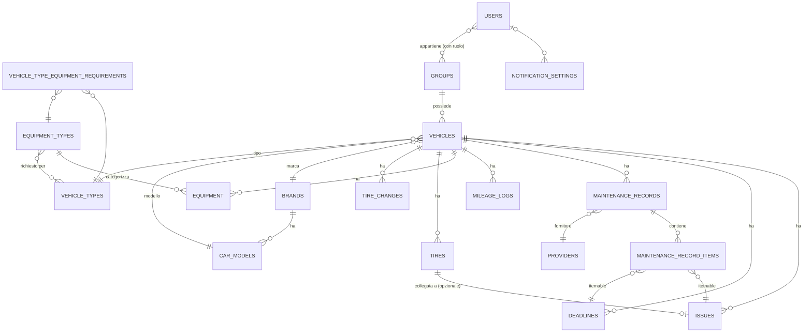

# 🚀 CV Backoffice

> Applicazione web per la gestione centralizzata di una flotta di mezzi di pubblica assistenza.
> Guasti, manutenzioni, scadenze, chilometraggi e dotazioni di bordo in un unico pannello.


---

## 🌟 Caratteristiche principali

- **Gestione completa del parco mezzi**: anagrafica veicoli, marche, modelli, tipologie e documenti
- **Flusso guasti e manutenzioni**: dalla segnalazione alla chiusura intervento, con collegamento polimorfico tra guasti, scadenze e appuntamenti in officina
- **Controllo scadenze e dotazioni**: revisioni ministeriali, ossigeno, tagliando, cinghia distribuzione, assicurazione — con stato automatico basato su data e km
- **Generazione automatica scadenze**: cinghia (10 anni o 100.000 km), tagliando (1 anno o km configurabili), rinnovo automatico al completamento intervento
- **Chilometraggi**: rilevazione mensile bulk, storico, integrazione con scadenze km
- **Gestione pneumatici**: ogni gomma è una riga singola con posizione (anteriore/posteriore, sinistra/destra); i cambi in officina possono riguardare 1, 2 o 4 gomme, non solo un set completo
- **Attrezzatura**: assegnazione di dotazioni già in anagrafica a un veicolo (anche spostandole da un altro veicolo)
- **Pagina pubblica stato flotta**: link segreto e non indovinabile, senza account, che mostra solo la disponibilità dei mezzi (nessun dato sensibile)
- **Dashboard interattiva**: statistiche, scadenze imminenti (con tempo/km residuo e stato), guasti aperti, equipaggiamento incompleto
- **Calendario appuntamenti**: vista mese/settimana con colori per tipo attività
- **Export PDF e CSV**: scheda veicolo PDF, export CSV per tutte le entità
- **API REST**: 12 endpoint protetti da token (Sanctum), pensati per un'eventuale app mobile
- **Audit log**: tracciamento completo di tutte le modifiche
- **Notifiche in-app**: campanella con badge, elenco notifiche, segna come letto
- **Notifiche email**: report giornaliero/settimanale/mensile configurabile con allegato PDF + email automatiche su eventi (scadenze, guasti, attrezzature)
- **Multi-tenancy per gruppo**: ogni utente appartiene a un gruppo (capo/sottocapo/membro), inviti via codice; l'isolamento dei dati tra gruppi è applicato in modo coerente su ogni superficie — pagine admin, Policies, API mobile, export CSV/PDF, cache, notifiche ed email schedulate
- **Gestione utenti**: creazione e gestione ruoli dal backoffice (solo capo)
- **Token API**: creazione e revoca dal profilo
- **Privacy/GDPR**: pagina privacy, cookie banner, export dati personali, trasferimento ruolo capo al delete account
- **Backup database**: comando Artisan + pulsante nella pagina impostazioni
- **Rate limiting**: protezione su login, route admin e API
- **Tema chiaro/scuro**: persistente in localStorage
- **Scansione libretto di circolazione**: crea un veicolo caricando fronte/retro del libretto, con un LLM vision (provider configurabile, OpenRouter di default) che precompila targa, marca/modello, dati tecnici e misura pneumatici — sempre verificati dall'utente prima di salvare

---

## 🛠️ Tech Stack

| Tecnologia                       | Scopo                               |
| :------------------------------- | :---------------------------------- |
| **Laravel 12 (PHP 8.2+)**        | Core applicativo e logica backend   |
| **Blade + Bootstrap 5 (Breeze)** | Interfaccia amministrativa          |
| **Livewire 4**                   | Componenti dinamici (VehicleSelect) |
| **MySQL / SQLite**               | Persistenza dati                    |
| **Laravel Sanctum**              | API token authentication            |
| **spatie/laravel-activitylog**   | Audit logging                       |
| **DomPDF**                       | Export PDF                          |
| **FullCalendar**                 | Calendario appuntamenti             |
| **OpenRouter (LLM vision)**      | Scansione libretto di circolazione  |

---

## 🚀 Quick Start

### Requisiti

- PHP 8.2+
- Composer
- Node.js 18+ e npm
- MySQL (oppure SQLite per sviluppo locale)

### Installazione

```bash
git clone https://github.com/mirkobechini/CV_Backoffice.git
cd CV_Backoffice
composer install
npm install
```

### Configurazione

```bash
cp .env.example .env
php artisan key:generate
php artisan storage:link
php artisan migrate --seed
php artisan import:car-data
php artisan make:admin
```

> **Nota:** non esiste una pagina di registrazione pubblica. Il primo account si crea con `php artisan make:admin` (diventa capo di un gruppo di default); da lì in poi i nuovi utenti vengono creati dal backoffice da un capo/sottocapo, oppure si uniscono a un gruppo esistente con il relativo codice invito.

### Avvio

```bash
# Due terminali separati:
npm run dev
php artisan serve
```

Apri il browser su `http://127.0.0.1:8000`.

---

## 📸 Screenshot

<!-- Aggiungi qui screenshot dell'app -->

---

## 🧪 Test

```bash
php artisan test
```

---

## ☁️ Deploy

L'app gira in produzione su [Laravel Cloud](https://cloud.laravel.com). Passi, variabili d'ambiente e comandi post-deploy sono documentati in [docs/DEPLOY.md](docs/DEPLOY.md).

---

## 📂 Struttura del progetto

```text
.
|-- app/
|-- bootstrap/
|-- config/
|-- database/
|-- docs/
|   |-- ADR.md           # Architecture Decision Records
|   |-- DEPLOY.md        # Deploy su Laravel Cloud
|-- public/
|-- resources/
|-- routes/
|-- tests/
|-- README.md
|-- composer.json
|-- package.json
```

---

## 📐 Decisioni architetturali

Le scelte architetturali del progetto sono documentate in un unico [Architecture Decision Record](docs/ADR.md). Copre:

- Relazioni polimorfiche (guasti/scadenze ↔ manutenzioni)
- SoftDeletes e stato automatico scadenze (data + km)
- Autenticazione Sanctum + ruoli (Policies)
- Notifiche email con scheduler
- Export PDF (DomPDF) e CSV
- Audit logging e ricerca FULLTEXT
- Gruppi e ruoli (capo/sottocapo/membro) con scoping dati per gruppo

---

## 🗄️ Schema del database


```mermaid
erDiagram
    %% Veicoli e anagrafica
    VEHICLES ||--o{ ISSUES : "ha"
    VEHICLES ||--o{ DEADLINES : "ha"
    VEHICLES ||--o{ MAINTENANCE_RECORDS : "ha"
    VEHICLES ||--o{ MILEAGE_LOGS : "ha"
    VEHICLES ||--o{ EQUIPMENT : "ha"
    VEHICLES ||--o{ TIRES : "ha"
    VEHICLES ||--o{ TIRE_CHANGES : "ha"
    TIRES ||--o| ISSUES : "collegata a (opzionale)"
    VEHICLES }o--|| BRANDS : "marca"
    VEHICLES }o--|| CAR_MODELS : "modello"
    VEHICLES }o--|| VEHICLE_TYPES : "tipo"

    BRANDS ||--o{ CAR_MODELS : "ha"

    EQUIPMENT_TYPES ||--o{ EQUIPMENT : "categorizza"
    EQUIPMENT_TYPES }o--o{ VEHICLE_TYPES : "richiesto per"

    VEHICLE_TYPE_EQUIPMENT_REQUIREMENTS }o--|| VEHICLE_TYPES : ""
    VEHICLE_TYPE_EQUIPMENT_REQUIREMENTS }o--|| EQUIPMENT_TYPES : ""

    %% Manutenzione polimorfica
    MAINTENANCE_RECORDS ||--o{ MAINTENANCE_RECORD_ITEMS : "contiene"
    MAINTENANCE_RECORD_ITEMS }o--|| ISSUES : "itemable"
    MAINTENANCE_RECORD_ITEMS }o--|| DEADLINES : "itemable"
    MAINTENANCE_RECORDS }o--|| PROVIDERS : "fornitore"

    %% Utenti e configurazione
    USERS |o--o{ NOTIFICATION_SETTINGS : ""
    USERS }o--o{ GROUPS : "appartiene (con ruolo)"
    GROUPS ||--o{ VEHICLES : "possiede"
```

**Legenda entità:**

| Tabella                               | Descrizione                                                                    |
| :------------------------------------ | :----------------------------------------------------------------------------- |
| `vehicles`                            | Veicoli (targa, codice, marca/modello, garanzia, cinghia, gruppo)              |
| `brands`                              | Marche veicoli                                                                 |
| `car_models`                          | Modelli veicoli (FK → brands)                                                  |
| `vehicle_types`                       | Tipologie mezzo (MSB, MSDA, ecc.) con requisiti equipaggiamento                |
| `issues`                              | Guasti (descrizione, stato, foto)                                              |
| `deadlines`                           | Scadenze (revisione ministeriale, ossigeno, tagliando, cinghia, assicurazione) |
| `maintenance_records`                 | Appuntamenti officina                                                          |
| `maintenance_record_items`            | Join polimorfico guasti/scadenze ↔ appuntamento                                |
| `mileage_logs`                        | Storico chilometraggi                                                          |
| `tires`                               | Pneumatici (uno per gomma fisica: stagionalità, posizione, stato)              |
| `tire_changes`                        | Storico montaggi/cambi gomme                                                   |
| `providers`                           | Fornitori (meccanico, carrozziere, gommista, ecc.)                             |
| `equipment`                           | Dotazioni di bordo (estintori, barelle, ecc.)                                  |
| `equipment_types`                     | Tipologie di dotazione (con frequenza revisione)                               |
| `vehicle_type_equipment_requirements` | Equipaggiamento obbligatorio per tipo mezzo                                    |
| `notification_settings`               | Configurazione report email                                                    |
| `notifications`                       | Notifiche in-app per utente                                                    |
| `groups`                              | Gruppi/associazioni (con codice invito)                                        |
| `group_user`                          | Pivot utenti ↔ gruppi con ruolo (capo/sottocapo/membro)                        |
| `users`                               | Utenti (il ruolo vive nel pivot group_user)                                    |

---

## 🗺️ Roadmap

### 🔜 Prossimi step

- [x] Notifiche in-app (badge e toast nella navbar)
- [x] Gestione utenti e ruoli da backoffice (gruppi e ruoli)
- [x] Gestione token API nel profilo
- [x] Privacy/GDPR (pagina privacy, cookie banner, export dati)
- [x] Backup database
- [ ] App mobile nativa (via API REST)

---

## 👤 Contatti

**Sviluppatore:** Bechini Mirko  
**Email:** mirkobechini@gmail.com  
**GitHub:** [github.com/mirkobechini](https://github.com/mirkobechini)

---

## 📄 Licenza

MIT
