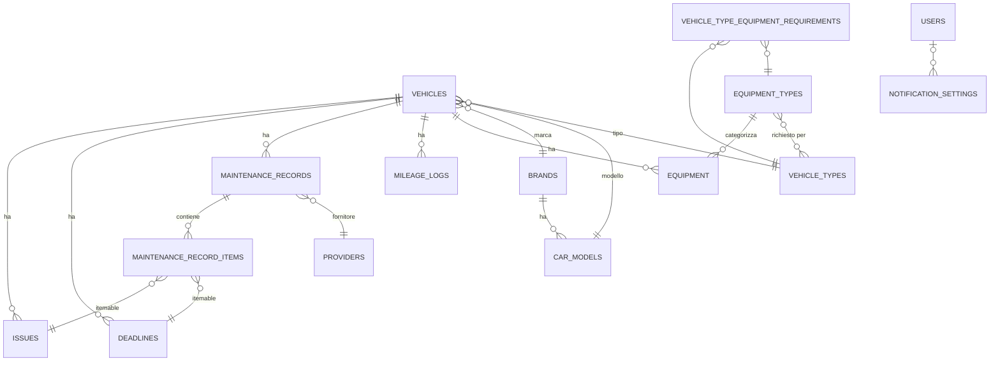

# 🚀 CV Backoffice

> Applicazione web per la gestione centralizzata di una flotta di mezzi di pubblica assistenza.
> Guasti, manutenzioni, scadenze, chilometraggi e dotazioni di bordo in un unico pannello.


---

## 🌟 Caratteristiche principali

- **Gestione completa del parco mezzi**: anagrafica veicoli, marche, modelli, tipologie e documenti
- **Flusso guasti e manutenzioni**: dalla segnalazione alla chiusura intervento, con collegamento polimorfico tra guasti, scadenze e appuntamenti in officina
- **Controllo scadenze e dotazioni**: revisioni ministeriali, ossigeno, tagliando, cinghia distribuzione, assicurazione — con stato automatico basato su data e km
- **Chilometraggi**: rilevazione mensile bulk, storico, integrazione con scadenze km
- **Dashboard interattiva**: statistiche, scadenze imminenti, guasti aperti, equipaggiamento incompleto
- **Calendario appuntamenti**: vista mese/settimana con colori per tipo attività
- **Export PDF e CSV**: scheda veicolo PDF, export CSV per tutte le entità
- **API REST**: 11 endpoint protetti da token (Sanctum)
- **Audit log**: tracciamento completo di tutte le modifiche
- **Notifiche email**: report giornaliero/settimanale/mensile configurabile
- **Rate limiting**: protezione su login e route admin
- **Tema chiaro/scuro**: persistente in localStorage
- **166 test, 330 assertions — tutti verdi** ✅

---

## 🛠️ Tech Stack

| Tecnologia | Scopo |
| :--------- | :---- |
| **Laravel 11 (PHP 8.2+)** | Core applicativo e logica backend |
| **Blade + Bootstrap 5 (Breeze)** | Interfaccia amministrativa |
| **Livewire 4** | Componenti dinamici (VehicleSelect) |
| **MySQL / SQLite** | Persistenza dati |
| **Laravel Sanctum** | API token authentication |
| **spatie/laravel-activitylog** | Audit logging |
| **DomPDF** | Export PDF |
| **FullCalendar** | Calendario appuntamenti |

---

## 🚀 Quick Start

### Requisiti

- PHP 8.2+
- Composer
- Node.js 18+ e npm
- MySQL (oppure SQLite per sviluppo locale)

### Installazione

```bash
git clone https://github.com/mirkobechini/CV_Backoffice.git
cd CV_Backoffice
composer install
npm install
```

### Configurazione

```bash
cp .env.example .env
php artisan key:generate
php artisan storage:link
php artisan migrate --seed
php artisan import:car-data
```

### Avvio

```bash
# Due terminali separati:
npm run dev
php artisan serve
```

Apri il browser su `http://127.0.0.1:8000`.

---

## 📸 Screenshot

<!-- Aggiungi qui screenshot dell'app -->

---

## 🧪 Test

```bash
php artisan test
# 166 tests, 330 assertions — all green ✅
```

---

## 📂 Struttura del progetto

```text
.
|-- app/
|-- bootstrap/
|-- config/
|-- database/
|-- public/
|-- resources/
|-- routes/
|-- tests/
|-- README.md
|-- composer.json
|-- package.json
```

---

## 🗄️ Schema del database


```mermaid
erDiagram
    %% Veicoli e anagrafica
    VEHICLES ||--o{ ISSUES : "ha"
    VEHICLES ||--o{ DEADLINES : "ha"
    VEHICLES ||--o{ MAINTENANCE_RECORDS : "ha"
    VEHICLES ||--o{ MILEAGE_LOGS : "ha"
    VEHICLES ||--o{ EQUIPMENT : "ha"
    VEHICLES }o--|| BRANDS : "marca"
    VEHICLES }o--|| CAR_MODELS : "modello"
    VEHICLES }o--|| VEHICLE_TYPES : "tipo"

    BRANDS ||--o{ CAR_MODELS : "ha"

    EQUIPMENT_TYPES ||--o{ EQUIPMENT : "categorizza"
    EQUIPMENT_TYPES }o--o{ VEHICLE_TYPES : "richiesto per"

    VEHICLE_TYPE_EQUIPMENT_REQUIREMENTS }o--|| VEHICLE_TYPES : ""
    VEHICLE_TYPE_EQUIPMENT_REQUIREMENTS }o--|| EQUIPMENT_TYPES : ""

    %% Manutenzione polimorfica
    MAINTENANCE_RECORDS ||--o{ MAINTENANCE_RECORD_ITEMS : "contiene"
    MAINTENANCE_RECORD_ITEMS }o--|| ISSUES : "itemable"
    MAINTENANCE_RECORD_ITEMS }o--|| DEADLINES : "itemable"
    MAINTENANCE_RECORDS }o--|| PROVIDERS : "fornitore"

    %% Utenti e configurazione
    USERS |o--o{ NOTIFICATION_SETTINGS : ""
```

**Legenda entità:**

| Tabella | Descrizione |
| :------ | :---------- |
| `vehicles` | Veicoli (targa, codice, marca/modello, garanzia, cinghia) |
| `brands` | Marche veicoli |
| `car_models` | Modelli veicoli (FK → brands) |
| `vehicle_types` | Tipologie mezzo (MSB, MSDA, ecc.) con requisiti equipaggiamento |
| `issues` | Guasti (descrizione, stato, foto) |
| `deadlines` | Scadenze (revisione ministeriale, ossigeno, tagliando, cinghia, assicurazione) |
| `maintenance_records` | Appuntamenti officina |
| `maintenance_record_items` | Join polimorfico guasti/scadenze ↔ appuntamento |
| `mileage_logs` | Storico chilometraggi |
| `providers` | Fornitori (meccanico, carrozziere, gommista, ecc.) |
| `equipment` | Dotazioni di bordo (estintori, barelle, ecc.) |
| `equipment_types` | Tipologie di dotazione (con frequenza revisione) |
| `vehicle_type_equipment_requirements` | Equipaggiamento obbligatorio per tipo mezzo |
| `notification_settings` | Configurazione report email |
| `users` | Utenti con ruolo (admin, manager, worker, volunteer) |

---

## 🗺️ Roadmap

### 🔜 Prossimi step

- [ ] Notifiche in-app (badge e toast nella navbar)
- [ ] Gestione utenti e ruoli da backoffice
- [ ] App mobile nativa (via API REST)

---

## 👤 Contatti

**Sviluppatore:** Bechini Mirko  
**Email:** mirkobechini@gmail.com  
**GitHub:** [github.com/mirkobechini](https://github.com/mirkobechini)

---

## 📄 Licenza

MIT
